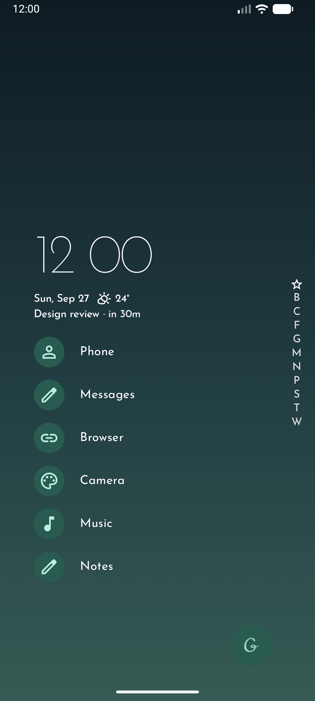
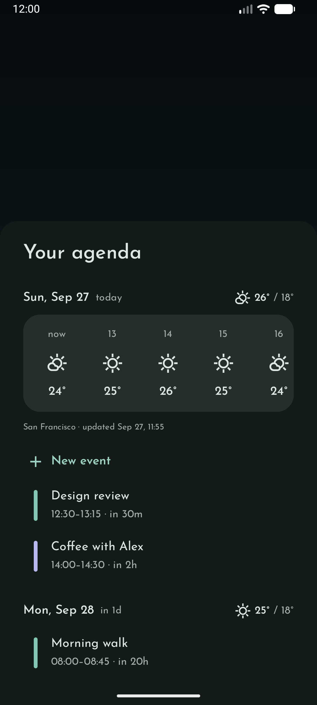
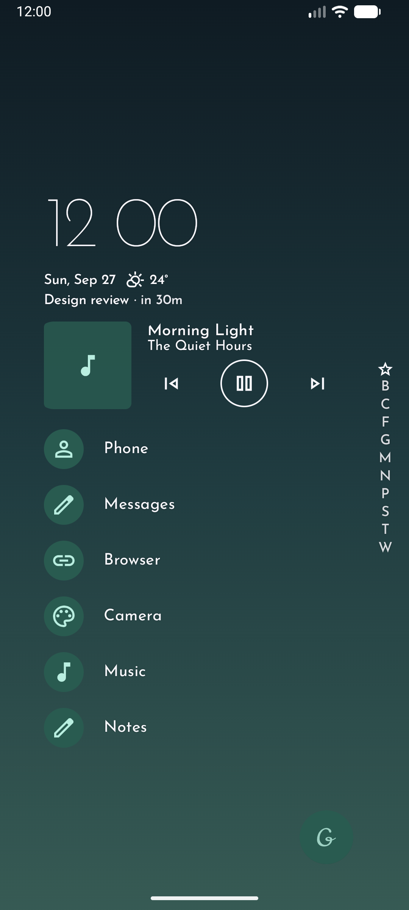
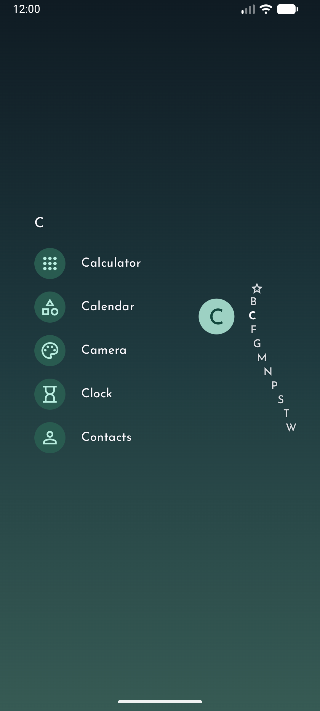

# Grace Launcher

Grace Launcher is an open-source Android launcher inspired by the design of [Niagara Launcher](https://niagaralauncher.app/). It is built with Kotlin and Jetpack Compose, with support for Material You and dynamic color.

## Features

- A list-based home screen and app drawer, inspired by Niagara Launcher
- A home screen music player with media controls
- Notifications directly on the home screen
- An integrated calendar agenda with weather forecasts
- Weather information on the home screen

Weather data is provided through [Breezy Weather](https://github.com/breezy-weather/breezy-weather), which must be installed and configured separately.

## Screenshots

| Home | Agenda & weather | Music controls | App list · C |
| --- | --- | --- | --- |
|  |  |  |  |

## Build from source

Install OpenJDK 21, Android SDK Platform 37 and Build Tools 36.1.0, then build the debug APK with the included Gradle wrapper:

```powershell
.\gradlew.bat :app:assembleDebug
```

The APK will be generated at `app/build/outputs/apk/debug/app-debug.apk`.

## F-Droid release preparation

English and Simplified Chinese store metadata live in `fastlane/metadata/android/`, with four English screenshots. See the [release guide (中文)](docs/FDROID.zh-CN.md) for signing and the GitLab submission steps. The [build metadata template](fdroid/com.galaxyrio.gracelauncher.yml.template) still needs the final release commit and public signing certificate fingerprint; it is not a completed F-Droid submission.

## Privacy

Grace Launcher does not request network access. Notification access is required to display notifications and control active media sessions on the home screen. All launcher data is stored locally on your device.

## Contributing

Contributions are welcome. Feel free to open an issue to report a bug or suggest an improvement, or submit a pull request with your changes.

Translations are managed through [Weblate](https://hosted.weblate.org/engage/grace_launcher/). You can help translate Grace Launcher into your language there.

<a href="https://hosted.weblate.org/engage/grace_launcher/">
  
</a>

## Acknowledgements

Special thanks to [Niagara Launcher](https://niagaralauncher.app/) for the design inspiration.

Grace Launcher is an independent project and is not affiliated with or endorsed by Niagara Launcher.

## License

Grace Launcher is licensed under the [GNU General Public License v3.0](LICENSE).
