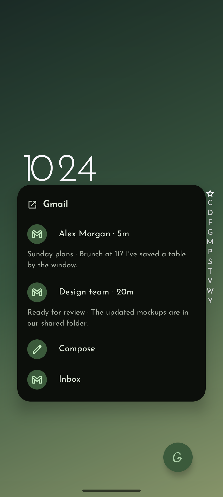
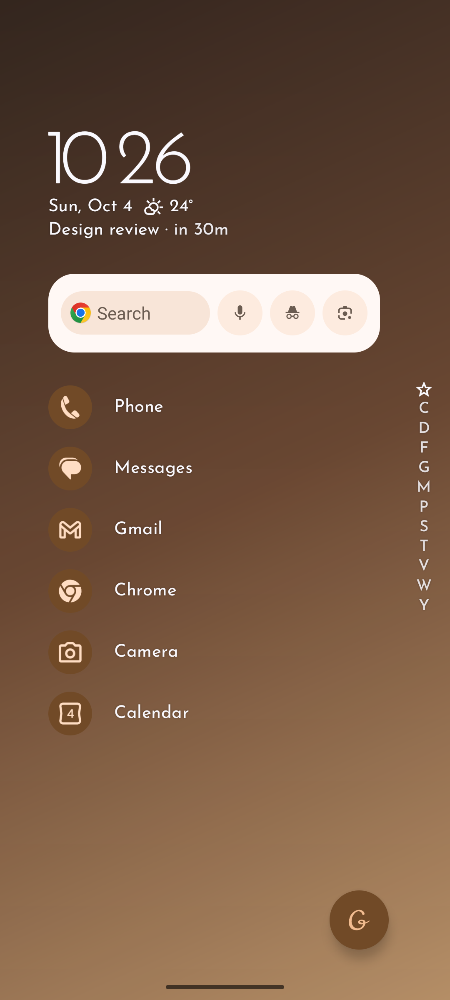
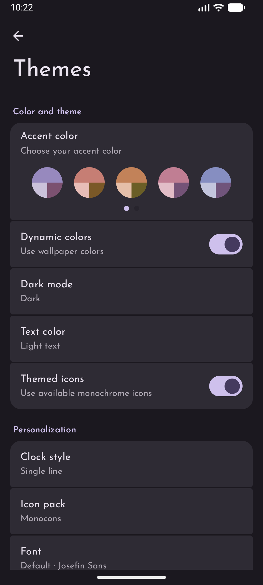
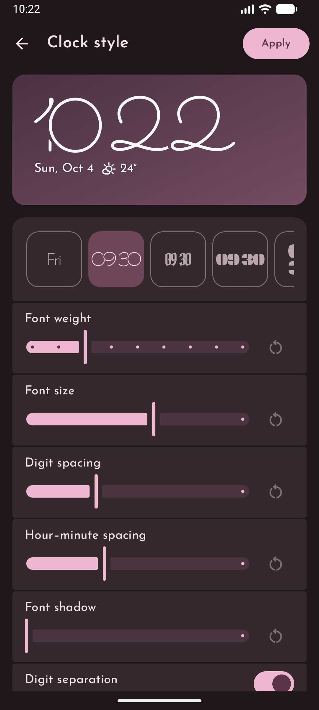
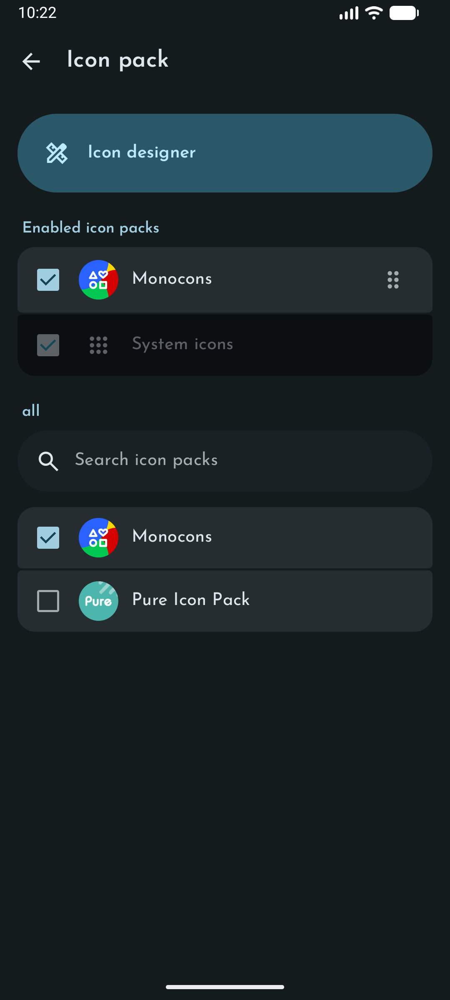
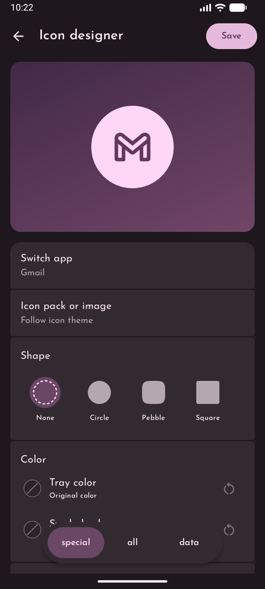

<div align="center">
  

  <h1>Grace Launcher</h1>

  <p><a href="README.md">English</a> | 简体中文</p>

  <p><strong>你的桌面，由你设计。</strong></p>
  <div>
    <a href="https://github.com/Galaxy-rio/GraceLauncher/stargazers"></a>
    <a href="https://github.com/Galaxy-rio/GraceLauncher/issues"></a>
  </div>
  <div>
    <a href="https://developer.android.com/about/versions/pie"></a>
    <a href="https://developer.android.com/studio"></a>
    <a href="https://kotlinlang.org/"></a>
    <a href="LICENSE"></a>
  </div>
  <p>
    <a href="https://github.com/Galaxy-rio/GraceLauncher/releases"></a>
    <a href="https://f-droid.org/packages/com.galaxyrio.gracelauncher/"></a>
  </p>
  <p>一款自由开源的 Android 桌面，提供简洁的应用列表、自定义图标与字体、可自行设计的时钟小组件，无追踪。</p>
</div>

## 功能

- **快速查找应用** — 将常用应用放在主屏幕，通过文件夹整理应用，使用字母索引浏览应用列表。
- **自定义图标包与字体** — 组合已安装的图标包并调整优先级，为桌面和时钟导入自定义字体。
- **Icon Designer（图标设计器）** — 允许你重新设计每一个应用图标，从图标包或自定义图片中选择素材，调整形状、颜色、大小和位置。
- **Clock Widget（时钟小组件）** — 自行设计桌面时钟小组件，定制布局、字体、字重、字号、间距和阴影。
- **更多丰富的自定义选项** — 支持 Material You 和动态取色、浅色与深色主题，以及背景模糊开关和强度控制。
- **自定义应用快捷方式与小组件** — 自由编辑应用的快捷方式弹窗，放入应用、快捷方式或小组件；也可在主屏幕添加小组件并调整大小。
- **掌握日常安排** — 直接在主屏幕查看通知，通过集成的日历日程查看事件与天气预报。
- **控制音乐播放** — 无需离开主屏幕即可控制正在播放的媒体。
- **保护隐私** — 无广告、无追踪，不申请网络权限；桌面数据保存在你的设备上。

使用 Kotlin、Jetpack Compose 和 Material You 构建。列表式桌面布局的设计灵感来自 [Niagara Launcher](https://niagaralauncher.app/)。

天气数据由 [Breezy Weather](https://github.com/breezy-weather/breezy-weather) 提供，需要另行安装并配置该应用。

## 截图

| 主屏幕 | 日程与天气 | 音乐控制 | 应用列表 | 应用快捷方式 |
| --- | --- | --- | --- | --- |
|  |  |  |  |  |

| 桌面小组件 | 主题 | 时钟样式 | 图标包 | 图标设计器 |
| --- | --- | --- | --- | --- |
|  |  |  |  |  |

## 下载

官方版本可从 [GitHub Releases](https://github.com/Galaxy-rio/GraceLauncher/releases) 和 [F-Droid](https://f-droid.org/packages/com.galaxyrio.gracelauncher/) 下载。

Grace Launcher 需要 Android 9（API 28）或更高版本。

## 从源码构建

安装 OpenJDK 21、Android SDK Platform 37 和 Build Tools 36.1.0，然后使用项目自带的 Gradle Wrapper 构建调试 APK。

Linux 或 macOS：

```shell
./gradlew :app:assembleDebug
```

Windows：

```powershell
.\gradlew.bat :app:assembleDebug
```

生成的 APK 位于 `app/build/outputs/apk/debug/app-debug.apk`。

## 隐私

Grace Launcher 不申请 Android 的 `INTERNET` 权限，也不包含广告或追踪功能。所有桌面数据均保存在你的设备上。

日历权限和通知访问权限均为可选：日历权限用于显示日程；通知访问权限用于在主屏幕显示通知和控制正在播放的媒体。天气由另行安装的 Breezy Weather 应用提供。

## 参与贡献

欢迎通过 Issue 报告问题或提出建议，也欢迎提交 Pull Request。

翻译由 [Weblate](https://hosted.weblate.org/engage/grace_launcher/) 管理。你可以在那里帮助将 Grace Launcher 翻译成自己的语言。

每种语言的 UI 文案统一放在一个 `strings.xml` 文件中：源文案位于 `app/src/main/res/values/strings.xml`，翻译位于 `values-<locale>/strings.xml`。使用分区注释组织文案，避免按功能拆分多个资源文件。

代码按职责组织：`data` 存放模型与数据存储，`platform` 集成 Android 系统服务，`ui` 存放功能界面，可复用的界面元素位于 `ui/components`。相关的小型辅助函数应保留在对应功能中，避免增加不必要的层级。

Git 会忽略生成的构建产物、临时截图、本地发布安装包，以及 `.local` 中的维护草稿。`.idea` 中仅提交共享的代码风格和检查配置；设备选择与其他本地 IDE 状态不纳入版本控制。

<a href="https://hosted.weblate.org/engage/grace_launcher/">
  
</a>

## 致谢

特别感谢 [Niagara Launcher](https://niagaralauncher.app/) 带来的设计灵感。

Grace Launcher 是独立项目，与 Niagara Launcher 没有关联，也未获得其背书。

## 许可证

Grace Launcher 使用 [GNU 通用公共许可证 v3.0](LICENSE) 授权。
